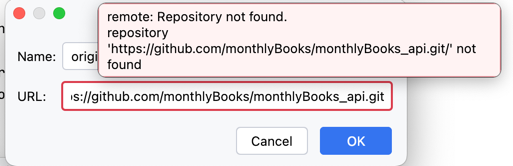
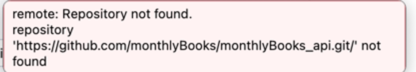

시작은 이것이다. 
나는 인텔리제이랑 연동을 똑바로 했는데 내 저장소를 왜 못찾을까
내 개인 저장소에서 pull push 는 문제없는데 내가만든
organization 에서 프로젝트를 찾을수 없다는거..  
보안 문제로 생각하고 token 발급 받고 해결했다.

그러다 생각한것 ssh key 와 personal token 차이 

나는 이전에 ssh key 를 발급받아서 소스트리에 등록해서 사용한적이 있다.
문제 없이 사용했고 여기에 대해 생각한적 없다. 

메세지를 보자 찾을수없는 저장소인데 https 가 붙어있다

ssh -key 랑 personal token 은 인증과 접근 방법의 차이 

1. HTTPS를 통한 Git 작업
   인증 방법: HTTPS URL을 사용하여 GitHub에 접근할 때, Personal Access Token 을 사용하여 인증  
   사용 예시: git clone https://github.com/user/repo.git  
         git push origin main (이전에 설정한 원격 URL이 HTTPS인 경우)  
   이때, 사용자는 GitHub 계정 비밀번호 대신 깃헙 토큰 을 사용하여 인증해야함, 이전엔 아이디 비밀번호로 가능했지만 깃헙에서 보안을 위해 바꿈

  
 2. SSH를 통한 Git 작업  
    인증 방법: SSH URL을 사용하여 GitHub에 접근할 때, SSH 키를 사용하여 인증  
    사용 예시: git clone git@github.com:user/repo.git  
    git push origin main (이전에 설정한 원격 URL이 SSH인 경우)  
    이 경우, 인증은 SSH 키를 통해 이루어지며, 따로 비밀번호나 토큰을 입력할 필요 없음

---

- <b> HTTPS를 사용하려면:  깃헙에서 토큰  
    

- <b> SSH를 사용하려면: 로컬 컴퓨터 에서 SSH 키를 생성한 후, 그 공개 키를 GitHub에 등록. 
   

 
